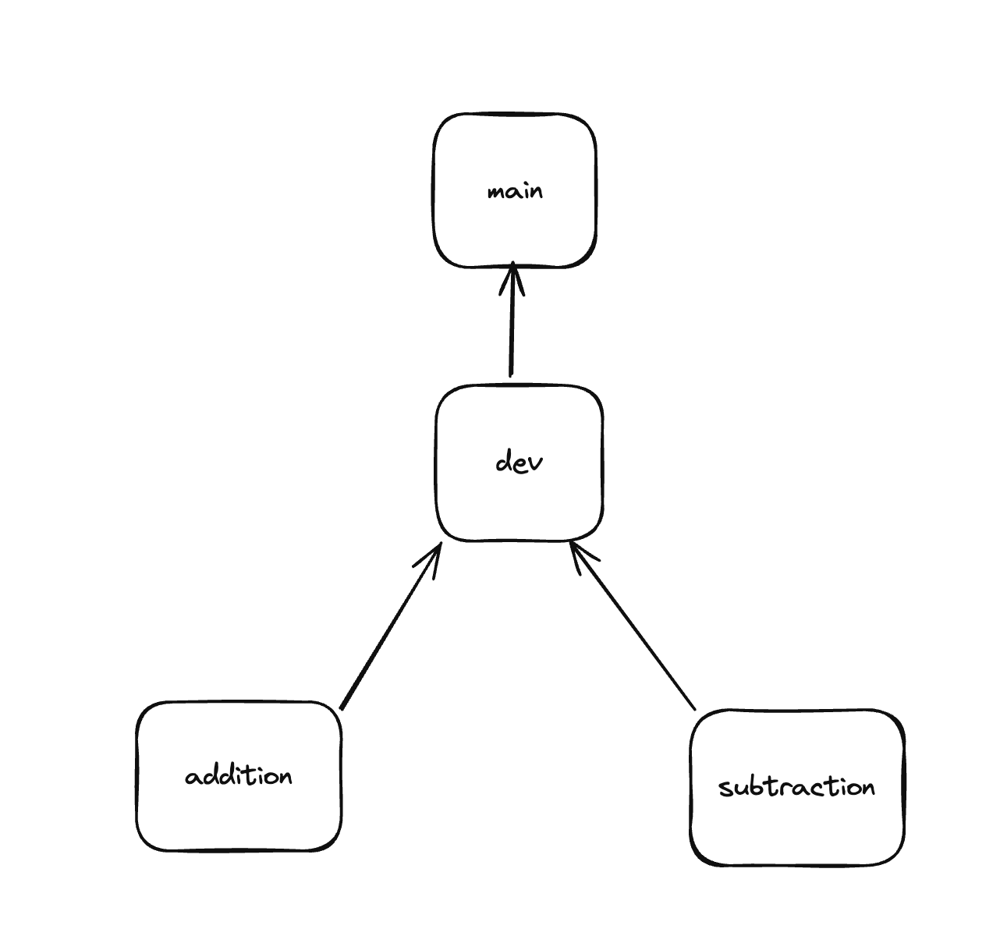

If you're collaborating with another person, to pull their changes you run

```sh
git pull origin main
```

`main` means that we are pulling the project from the same branch (main).



In this case, we have 4 branches: main, dev, addition and subtraction.

--

To check what branch you are using

```sh
git branch
```

To exit, press `q` if it shows something like this
```sh
* main
(END)
```


To fetch all branches, run this.

```sh
git fetch --all
```

You should see something like

```sh
From github.com:innv8/learngit
 * [new branch]      addition    -> origin/addition
 * [new branch]      dev         -> origin/dev
 * [new branch]      subtraction -> origin/subtraction
```

This means we have downloaded three more branches.

To change whatever branch you want to use, do

```sh
git checkout dev
```

Once you make the changes, commit and push
```sh
git add .
git commit -m "changes"
git push origin dev
```

Once you have made your changes, go to Github and create a pull request which will be added by the manager